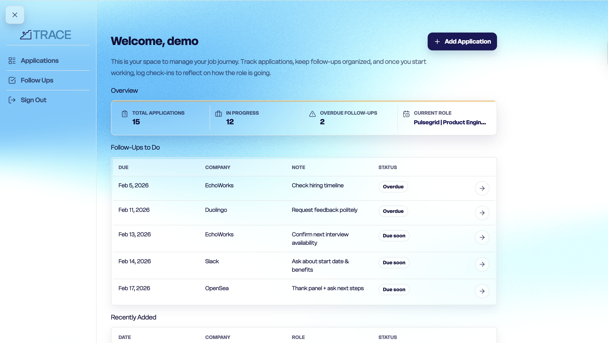

# TRACE
A job application tracking platform to organize applications, follow-ups, and on-the-job check-ins.

# Screenshot/Logo 

# Description
TRACE is a full-stack job application tracking web app that helps users stay organized throughout the entire job journey, from applying, to following up, reflecting on progress once they start working.

The app allows users to log job applications with key details like company, role, and status, attach scheduled follow-ups to keep outreach on track, and create ongoing check-ins after starting a role to reflect on progress and overall experience over time.

TRACE was built to address a real problem, experienced during our own job search: losing track of where applied, forgetting to follow up, and having no structured way to reflect once started working. TRACE focuses on clarity, continuity, and intention, helping users always know what they’ve done, what’s next, and how things are going.

# Deployment Link
Live App:

# Demo Login (for reviewers):
Username: demo
Password: 1234

# Backend GitHub Repo
Link: https://github.com/K2222810/trace-back-end

# Frontend GitHub Repo
Link: https://github.com/K2222810/trace-front-end

# Timeframe & Working Team
Timeframe: 1 week
Team: Group project

* This project was designed, planned, and built in a group of two, including Alejandro and Sagrika Trehan.

# Planning
Began by defining the full lifecycle of a job search and identifying the core MVP features before writing any code.

Planning included:
* Writing user stories for applications, follow-ups, and check-ins
* Building an ERD to model data relationships
* Defining a component hierarchy diagram to ensure front-end clarity
* Wireframing key pages:
    - Dashboard
    - Applications list
    - Application detail view
	- Follow-ups
	- Check-ins
	- Designing the data flow between applications, follow-ups, and check-ins
	- Identifying MVP scope and intentionally cutting non-essential features

# Planning Materials
Figma: https://www.figma.com/design/zyg34mwgMU5HrzjV2grQci/SE--PROJECTS?node-id=161-2&t=qn288Sy0TlxtZVNn-1 

Trello: https://trello.com/invite/b/698e13d8104243de84b1588f/ATTIff2c7ec506fde66afa73c77ef5444a51782D2287/web-jsx-project

# Brief
The brief for this project was to build a full-stack web application using the MERN stack with secure user authentication and full CRUD functionality.

The application needed to support JWT-based authentication, user-owned data, and RESTful routing on the back end, while the front end was built with React and communicated with the API through asynchronous requests.

# Build Process
The project was built incrementally, starting with authentication and data modeling, followed by core feature development and UI refinement.

The process included designing MongoDB models and relationships, implementing a RESTful API with Express and Node, and securing routes with JWT-based authorization. Once the back end was stable, the React front end was built to consume the API and provide full CRUD functionality for applications, follow-ups, and check-ins.

Development focused on maintaining clean data flow, consistent state management, and a clear, user-friendly interface across all pages.

# Technologies Used
Back End
	- Node.js
	- Express
	- MongoDB
	- Mongoose
	- JSON Web Tokens 
	- RESTful API architecture

Front End
	- React
	- Vite
	- JavaScript 
	- CSS 
	- React Router

Other Tools & Practices
	- Git & GitHub 
	- JWT-based authentication and authorization
	- Asynchronous API communication 
	- Modular component-based architecture
    - WCAG-conscious UI/UX decisions

# Key highlights
* Full job-search lifecycle tracking in a single application
Users can log applications, attach follow-ups with due dates, and transition into ongoing check-ins once they begin working.

* Clear data relationships across features
Applications act as the central resource, with follow-ups and check-ins linked directly to each role for better context and organization based on status.

* Secure, user-owned data
JWT-based authentication and authorization ensure that users can only access and modify their own applications, follow-ups, and check-ins.

* Thoughtful UI and UX decisions
The interface focuses on clarity and flow, helping users quickly understand what needs attention and what stage they are in.

# Challenges
* Team collaboration and Git workflow
This was the first time working in a shared codebase using feature branches, pull requests, and merges. Coordinating changes and resolving merge conflicts required careful communication and discipline.

* Communication under time constraints
With a short project timeline and a small team, staying aligned on responsibilities, feature ownership, and integration points was an ongoing challenge.

* Balancing scope and polish
It was important to prioritize core functionality while resisting the urge to over-build features early.

# Wins
* Successful team collaboration
Despite the learning curve with Git and branching, the team adapted quickly and maintained a stable main branch throughout the project.

* Playing to individual strengths
Working in a small team made it easier to divide responsibilities based on strengths, which helped move faster and maintain quality.

* Delivering a complete, functional product
The project met all MVP requirements with full CRUD functionality, authentication, and a cohesive user experience within the given timeframe.

# Key Learnings / Takeaways
* Gained practical experience with collaborative Git workflows
Including branching strategies, pull requests, and resolving merge conflicts.

* Improved communication and planning in a team setting
Clear ownership and regular check-ins proved essential to progress.

* Deepened understanding of how back-end structure impacts front-end UX
Thoughtful API design directly improved usability and data flow on the client side.

# Future Improvements
* Add visual insights for check-ins over time
    -Such as mood or experience trends across a role.
* Introduce reminders or notifications for upcoming follow-ups or check-ins
* Enhance filtering and sorting options across applications.
* Improve accessibility and keyboard navigation.